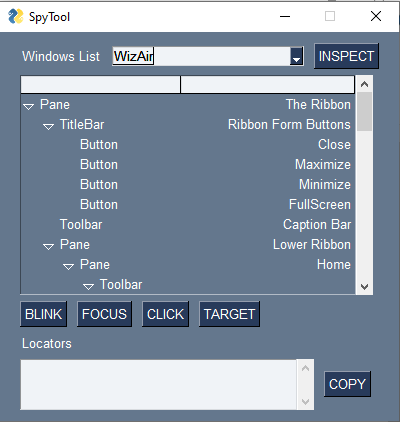
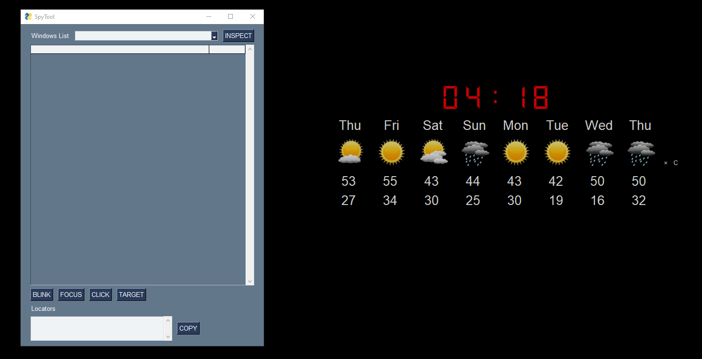

# Spy Tool for pywinauto

## Review

Due to the lack of good analyzers for screen elements for windows applications, this project brings a new approach so that new features and development are customized in order to create good screen analyzers

---

## The structure

This projects was build using pywinauto to get all windows elements, for the UI is used the lib PySimpleGUI and PyGame (used only to create a rectangle in the screen)

## See the tool execution in animation bellow

*Thanks to [PySimpleGUI](https://github.com/PySimpleGUI) for the gif animation.*

---

## Features

---

### Version 1.0

- Visual Inspection
- Elements organized in the tree
- Locators to be used in pywinauto generated
- Live actions like blink, click, focus and target
- Works with windows applications and web pages
